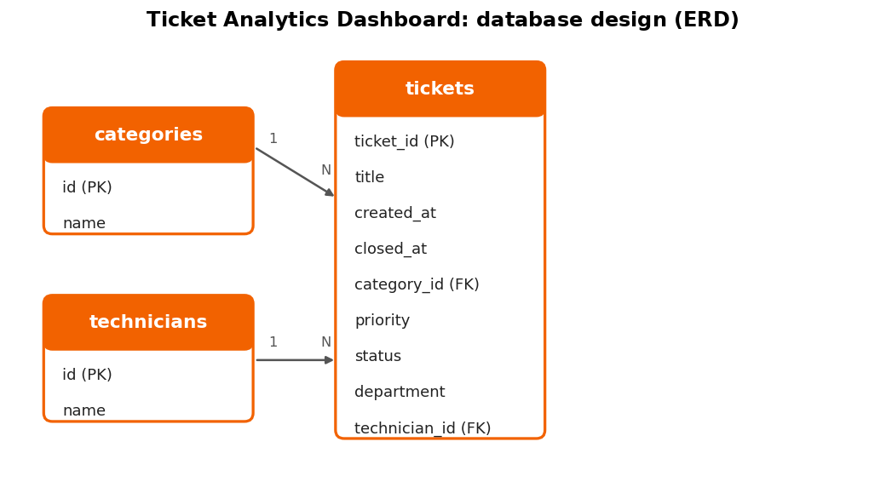
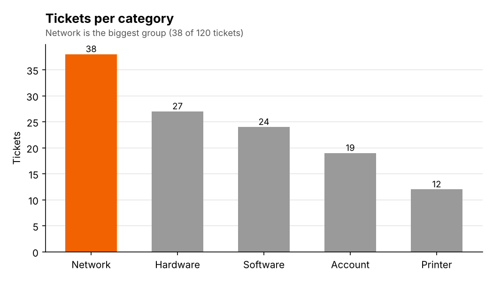
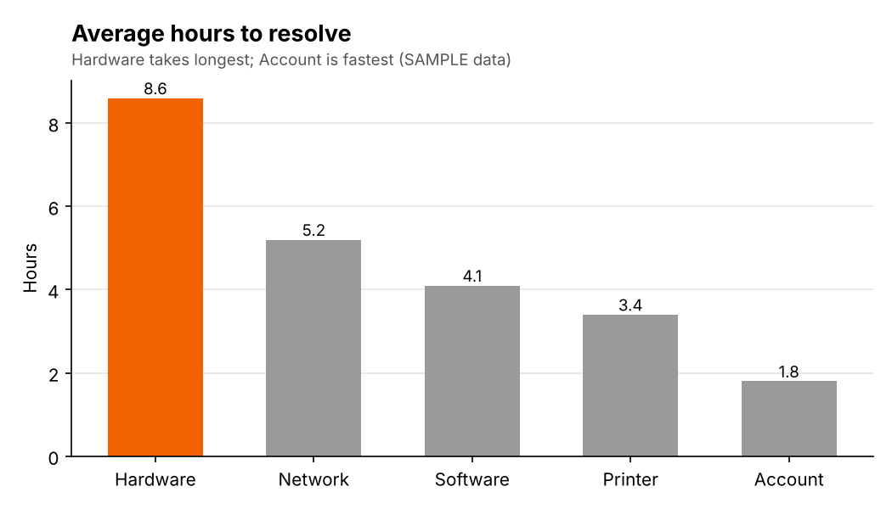
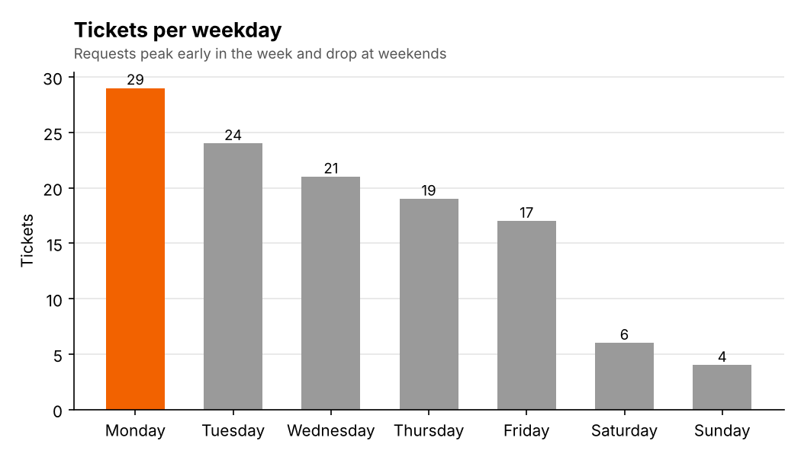
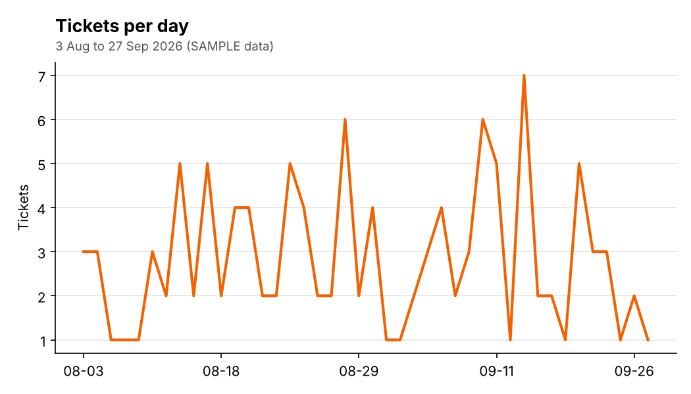

# Ticket Analytics Dashboard

A data analysis project on IT support tickets: raw data, cleaning, SQL analysis, charts and an Excel dashboard that show which problems happen most, how long they take to resolve, when requests peak, and what the IT team should do about it.

**Status:** Finished on sample data | **Portfolio:** https://github.com/Warden64595/project-personal-portfolio

## 1. Project Overview
This project analyzes IT support tickets with SQL and Excel (or Google Sheets). It turns raw ticket records into clear charts, a dashboard, and written recommendations that help an IT team plan its work.

## 2. Problem Statement
IT teams receive many tickets but rarely study the pattern. Without analysis, repeat problems stay unfixed and staff are not scheduled for the busiest days.

## 3. Objectives
1. Clean and organize the ticket data.
2. Answer four questions with SQL: what happens most, how long it takes to fix, when requests peak, and who handles them.
3. Build charts and a dashboard in Excel or Google Sheets.
4. Write findings and recommendations based on the results.

## 4. Target Users
| User | How they use the results |
|---|---|
| IT manager | Plans staffing and priorities |
| Help desk technicians | Finds and fixes repeat problems |

## 5. Data Source
**Sample data:** 120 made-up tickets created for this project, from 3 August to 27 September 2026. They are not real company tickets and contain no personal information.

> **Privacy note:** Do not upload real company data without permission. Remove names, employee IDs and any confidential details first, or use sample data.

## 6. Tools Used
| Purpose | Tool |
|---|---|
| Database | MySQL (full script) and SQLite (ready-made file) |
| Queries | SQL |
| Cleaning and charts | Python 3 (a cleaning script and matplotlib charts) |
| Formulas, charts, dashboard | Excel (`dashboard.xlsx`) |
| Version control | Git and GitHub |

## 7. Deliverables
- [x] Raw data file and cleaned dataset
- [x] Database (MySQL script and SQLite file)
- [x] SQL queries file
- [x] Charts (PNG images)
- [x] Excel dashboard
- [x] Findings and recommendations
- [x] This README
(All finished on the sample data. Findings will be replaced when real data is used.)

## 8. Repository Structure
```
ticket-analytics-dashboard/
├── README.md, REQUIREMENTS.md, TEST_CASES.md
├── data/raw/          tickets_raw.csv: the messy export (SAMPLE data)
├── data/              tickets.csv (cleaned), categories.csv, technicians.csv, README.md
├── analysis/          make_raw_export.py, clean_data.py, make_charts.py
├── database/          ticket_analytics.sql (MySQL), ticket_analytics.db (SQLite), export_results.py
├── sql/               schema.sql, queries.sql (MySQL), queries_sqlite.sql
├── results/           CSV result of each SQL query
├── charts/            four chart images (PNG)
├── dashboard/         dashboard.xlsx (formulas, KPI tiles, charts)
└── docs/              erd.png, dashboard.png
```

## 9. Data Dictionary
| Column | Type | Meaning |
|---|---|---|
| ticket_id (PK) | Number | Unique ticket number |
| title | Text | Short description of the problem |
| created_at | Date and time | When the ticket was opened |
| closed_at | Date and time | When it was resolved (empty if still open) |
| category_id (FK) | Number | Links to categories (Network, Hardware, Software, Account, Printer) |
| priority | Text | Low, Medium or High |
| status | Text | Open, In progress or Closed |
| department | Text | Who reported the problem |
| technician_id (FK) | Number | Links to technicians |

## 10. Database Design


```sql
CREATE TABLE categories  (id INT PRIMARY KEY AUTO_INCREMENT, name VARCHAR(50) NOT NULL);
CREATE TABLE technicians (id INT PRIMARY KEY AUTO_INCREMENT, name VARCHAR(80) NOT NULL);
CREATE TABLE tickets (
  ticket_id     INT PRIMARY KEY,
  title         VARCHAR(120) NOT NULL,
  created_at    DATETIME NOT NULL,
  closed_at     DATETIME NULL,
  category_id   INT NOT NULL,
  priority      ENUM('Low','Medium','High') NOT NULL,
  status        ENUM('Open','In progress','Closed') NOT NULL,
  department    VARCHAR(60),
  technician_id INT,
  FOREIGN KEY (category_id)   REFERENCES categories(id),
  FOREIGN KEY (technician_id) REFERENCES technicians(id)
);
```

## 11. Data Cleaning
`data/raw/tickets_raw.csv` is a deliberately messy export of the sample data (123 rows). `python analysis/clean_data.py` cleans it into `data/tickets.csv` (120 rows) and prints this report:

| Problem in the raw file | Fix | Count |
|---|---|---|
| Duplicate ticket rows | Keep the first row of each ticket_id | 3 removed |
| Extra spaces and mixed spelling ("network", "NETWORK", " Network ") | Trim and standardize category, priority and title | 25 rows fixed |
| Two date formats (`2026-08-03 13:04:00` and `08/03/2026 01:04 PM`) | Convert to one `YYYY-MM-DD HH:MM:SS` format | 18 rows converted |
| Closed before created | Check `closed_at` is after `created_at` | 0 found |
| Category and technician written as names | Replace with ids from categories.csv and technicians.csv | 120 rows |

The raw file was generated from the sample data to practise cleaning, so it is not a real company export.

## 12. SQL Queries
All queries are in `sql/queries.sql`.
| # | Question | Result used for |
|---|---|---|
| 1 | Tickets per category | Bar chart |
| 2 | Average hours to resolve, per category | Bar chart |
| 3 | Tickets per weekday | Bar chart |
| 4 | Tickets per day | Line chart |
| 5 | Repeat problems | Findings |
| 6 | Technician workload | Findings |

Example:
```sql
SELECT c.name AS category, COUNT(*) AS total
FROM tickets t JOIN categories c ON t.category_id = c.id
GROUP BY c.name ORDER BY total DESC;
```

## 13. Charts and Excel Dashboard
**Charts** (made by `analysis/make_charts.py` from the SQL results)






**Excel dashboard:** `dashboard/dashboard.xlsx` has four KPI tiles and three charts, driven by live formulas on the `Tickets` sheet.


## 14. Findings and Recommendations
**Findings (on the sample data):** Network is the biggest category with 38 of 120 tickets (32%), followed by Hardware (27) and Software (24). Hardware tickets take the longest to resolve, 8.6 hours on average, and Account tickets are the fastest at 1.8 hours. Monday is the busiest weekday with 29 tickets, and weekends are quiet (10 tickets). The most repeated problems are "Cannot reach shared folder" and "Cannot connect to Wi-Fi", with 10 tickets each. Because the data is sample data, these findings show how the analysis works. They are not real results.

**Recommendations:** Put the most effort into network problems and fix the repeat causes first, such as shared folder access and Wi-Fi connection. Look at why Hardware tickets take about 8.6 hours to fix, for example by keeping common spare parts ready. Schedule more technicians on Mondays and fewer on weekends.

## 15. How to Reproduce
```bash
git clone https://github.com/Warden64595/ticket-analytics-dashboard.git
cd ticket-analytics-dashboard
```
**Step 0: Clean the raw data** (optional, the cleaned file is already included): `python analysis/clean_data.py`

**Option A: MySQL** (for example with XAMPP and phpMyAdmin)
1. Open phpMyAdmin, click **Import**, choose `database/ticket_analytics.sql`, and click **Go**. This creates the `ticket_analytics` database with all three tables and the sample data.
2. Open the **SQL** tab and run the queries in `sql/queries.sql`.

**Option B: SQLite** (no server to install)
1. Open `database/ticket_analytics.db` with the free program DB Browser for SQLite and run the queries in `sql/queries_sqlite.sql`.
2. Or run `python database/export_results.py`. It reads the database, prints the six results and saves them as CSV files in `results/`.

Then run `python analysis/make_charts.py` to redraw the chart images, and open `dashboard/dashboard.xlsx` to see the Excel dashboard.

## 16. Testing and Data Quality Checks
| Check | How I check it | Result |
|---|---|---|
| Cleaning keeps the right rows | 123 raw rows minus 3 duplicates | Pass: 120 clean rows |
| Row count matches the source file | Compare counts in SQL and in the cleaned file | Pass: 120 rows in the file and in the database |
| No duplicate ticket_id | `GROUP BY ticket_id HAVING COUNT(*) > 1` | Pass: no duplicate ticket numbers |
| No ticket closed before it was created | Query where `closed_at < created_at` | Pass: no ticket is closed before it was created |
| SQL totals match the Excel dashboard totals | Compare each chart total with the Excel dashboard | Pass: totals match the Excel dashboard |
| Category names are consistent | List the distinct category values | Pass: only the 5 agreed category names are used |

## 17. Limitations
The data is a small sample: 120 made-up tickets over 8 weeks, all of them closed, so the findings only show how the analysis works. The analysis runs on a local computer. SQLite suits this small data set; MySQL would be used for larger data.

## 18. Future Improvements
Use real tickets (with permission and with names removed), add more months of data, build a Power BI version of the dashboard, and add a ticket entry web form (a Flask login and create/edit/delete prototype is kept separately).

## 19. Use of AI Tools
AI tools helped me plan the project and draft the SQL queries and documentation. I supplied my own details and decided what the project includes. The data quality checks (row counts, duplicates, dates, category names, and SQL totals against the Excel dashboard) pass. See the AI usage log in my portfolio.

## 20. Developer
**Edward S. Vidal**, BSIT, Datamex College of Saint Adeline
GitHub: https://github.com/Warden64595 | LinkedIn: https://www.linkedin.com/in/edward-vidal-5536613a5 | Email: edwardsajovidal@gmail.com
